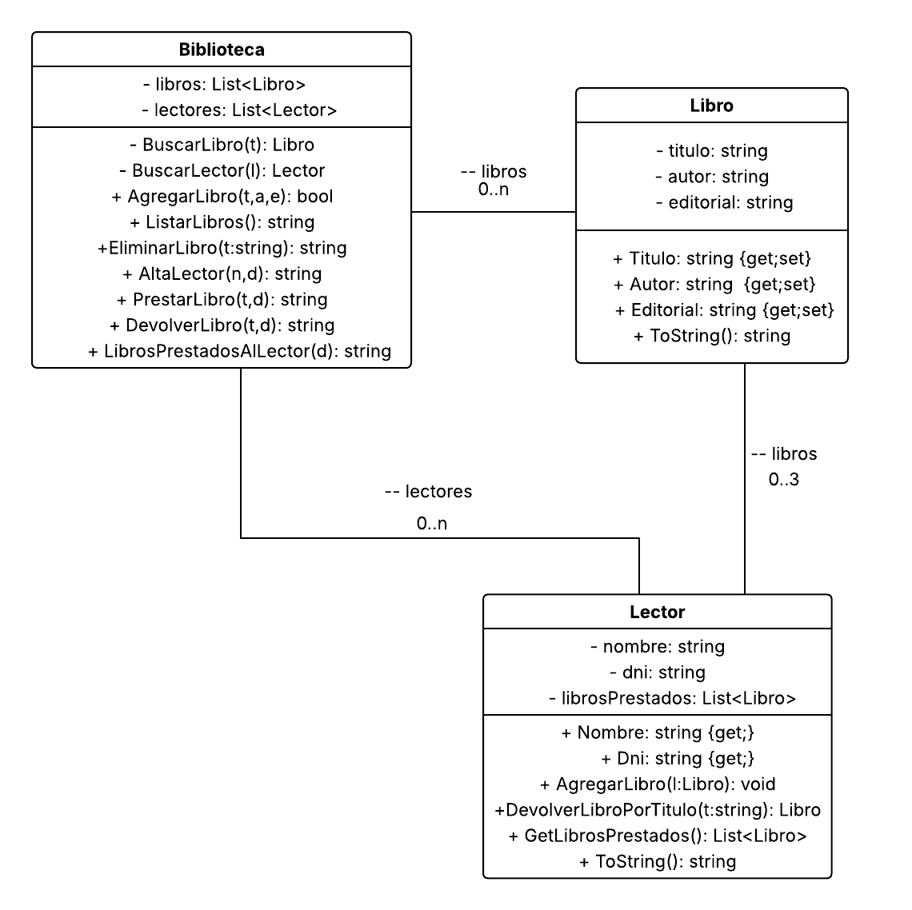

# Sistema de Biblioteca

## Materia: Desarrollo de Software Orientado a Objetos  
## Comisión: A  
## Grupo: 15  

### Integrantes del Equipo

Este proyecto fue desarrollado por el siguiente equipo de trabajo:

- **Iván Shifman**  
  Email: ivanshifman1300@gmail.com  
  Nombre Completo: Iván Ezequiel Shifman  

- **Ángel Sabato**  
  Email: 19angel.s89@gmail.com  
  Nombre Completo: Ángel Sabato  

- **Flavio Rinaldi**  
  Email: flaviorin@gmail.com  
  Nombre Completo: Flavio Rinaldi 

- **Marcelo Zárate**  
  Email: mandrakes@gmail.com  
  Nombre Completo: Marcelo Zárate

- **Ana Schneider**  
  Email: anaesneider@gmail.com  
  Nombre Completo: Ana Schneider  

---

## Descripción

Este proyecto simula una biblioteca en la que los usuarios pueden:  

- Registrar lectores.  
- Agregar libros a la biblioteca.
- Eliminar libros de la biblioteca.
- Listar los libros disponibles.  
- Realizar préstamos de libros.
- Visualizar los libros prestados.
- Devolver libros prestados.


Se aplican restricciones en los préstamos: cada lector puede tener como máximo **3 libros en préstamo al mismo tiempo**.  

---

## Objetivo del Trabajo Práctico

El objetivo es desarrollar un **sistema de gestión de biblioteca** aplicando principios de **programación orientada a objetos en C#**, con la implementación de:  

- **Colección de libros** en la biblioteca.  
- **Colección de lectores registrados**.  
- **Método AltaLector**, para dar de alta un lector si no estaba previamente registrado.  
- **Método PrestarLibro**, que recibe el título de un libro y el DNI del lector solicitante, y retorna un string con alguno de los siguientes valores:  
  - `"Se prestó el libro 'X' al lector con DNI 12345678. \nPRESTAMO EXITOSO"`  
  - `"El libro con título 'X' no existe en la biblioteca. \nLIBRO INEXISTENTE"`  
  - `"El lector con DNI 12345678 ha alcanzado su tope de préstamos. \nTOPE DE PRESTAMO ALCANZADO"`  
  - `"No se puede realizar el préstamo: lector con DNI 12345679 no existe."`  


---

## Funcionalidades implementadas

 **Alta de Lector**: Registra un nuevo lector con nombre y DNI, devolviendo un mensaje de confirmación.  
- **Agregar Libro**: Agrega un libro con título, autor y editorial a la biblioteca, validando duplicados.  
- **Prestar Libro**: Gestiona préstamos con las validaciones mencionadas en la consigna y devuelve un string con el resultado.  
- **Listado de Libros**: Muestra por consola los libros actualmente disponibles.  
- **Eliminar Libro**: Permite quitar un libro existente de la biblioteca, devolviendo un mensaje de éxito o error.  
- **LibrosPrestadosAlLector**: Devuelve un string con el listado de libros que tiene prestado un lector, o un mensaje de error si no existen o     no tiene libros.  
- **Devolver Libro**: Devuelve un libro prestado a la biblioteca, con validaciones y mensaje de estado.  


---

## Diseño del Sistema

El sistema se compone de las siguientes clases principales:  

- **Libro**  
  Representa un libro, con atributos `Titulo`, `Autor` y `Editorial`.  

- **Lector**  
  Representa un lector registrado, con `Nombre`, `Dni` y la lista de `LibrosPrestados`.  
  Permite controlar la cantidad máxima de préstamos (3).  

- **Biblioteca**  
  Gestiona los libros y lectores. Contiene los métodos `agregarLibro`, `listarLibros`, `eliminarLibro`, `altaLector` y `prestarLibro`.  

Adicionalmente se agregaron los siguientes métodos: `devolverLibro`, `librosPrestadosAlLector`.


## Diagrama de clases



---

## Casos de Prueba y Ejemplos

Ejemplos de uso según lo implementado:  

1. **Alta de un lector**  
   - Entrada: `Nombre = "Pepe"`, `DNI = "12345678"`  
   - Salida:  
     ```
     SE DIO DE ALTA AL LECTOR Pepe
     ```

2. **Préstamo de un libro existente**  
   - Entrada: `Título = "Libro3"`, `DNI = "12345678"`  
   - Salida:  
     ```
     Se prestó el libro 'Libro3' al lector con DNI 12345678. 
     PRESTAMO EXITOSO
     ```

3. **Préstamo con lector inexistente**  
   - Entrada: `Título = "Libro3"`, `DNI = "12345679"`  
   - Salida:  
     ```
     No se puede realizar el préstamo: lector con DNI 12345679 no existe.
     ```

4. **Préstamo con libro inexistente**  
   - Entrada: `Título = "Libr3"`, `DNI = "12345678"`  
   - Salida:  
     ```
     El libro con título 'Libr3' no existe en la biblioteca. 
     LIBRO INEXISTENTE
     ```

5. **Préstamo con tope de préstamos alcanzado**  
   - Entrada: `Título = "Libro5"`, `DNI = "12345678"` (lector ya tiene 3 libros prestados)  
   - Salida:  
     ```
     El lector con DNI 12345678 ha alcanzado su tope de préstamos. 
     TOPE DE PRESTAMO ALCANZADO
     ```
---

## Requisitos

- **.NET 8 o superior**  
- **Visual Studio 2019/2022** o cualquier IDE compatible con C#  

---

## Tecnologías utilizadas

- **C#**: Lenguaje de programación.  
- **.NET**: Framework utilizado.  
- **POO (Programación Orientada a Objetos)**: Encapsulamiento, clases, objetos y colecciones genéricas (`List<T>`).  

---

## Conclusiones

El desarrollo de este sistema permitió:  

- Aplicar conceptos de **POO en C#**.  
- Implementar y gestionar colecciones de objetos (`libros` y `lectores`).  
- Controlar restricciones de negocio (máximo de 3 préstamos por lector).  
- Simular un sistema de biblioteca básico con validaciones de datos y operaciones esenciales.  
- Producir **mensajes claros y detallados** que facilitan la prueba de cada caso en la ejecución de consola.
